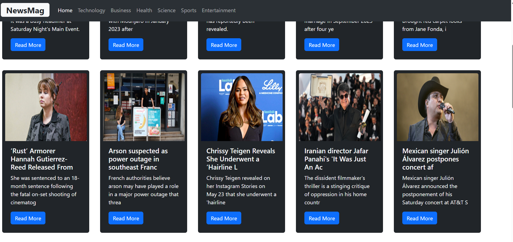

# Project Title
NewsMag - A news aggregator application that fetches news from various sources and displays them in a user-friendly interface.

## Description
NewsMag is a modern news aggregator built with React and Vite. It fetches the latest headlines from NewsAPI and displays them in a clean, responsive interface. Users can browse news by categories such as Technology, Business, Health, Science, Sports, and Entertainment. The app features attractive card layouts, category navigation, and real-time updates.

## Usage

How my Homepage looks like

How my entertainment News looks like

 
How my Techology News looks like
